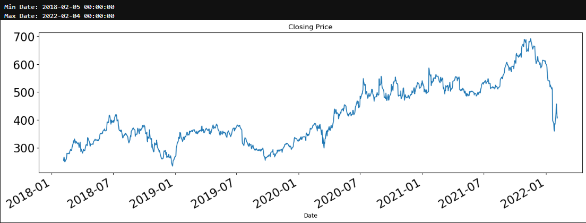
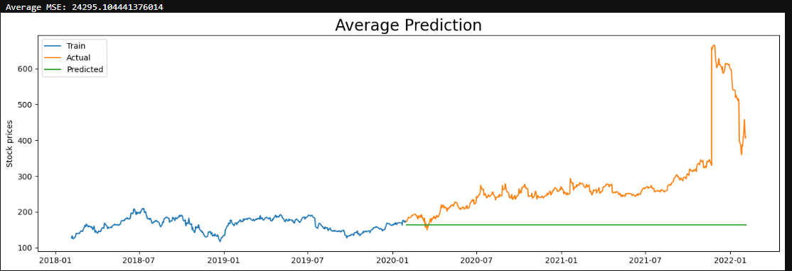
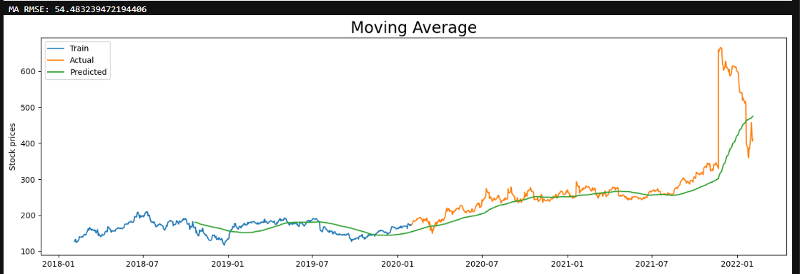
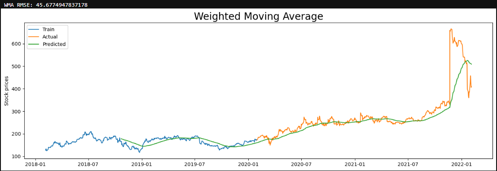
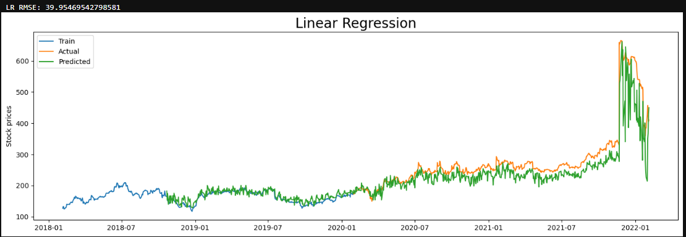

# Stock Price Prediction Model

A Python-based system that predicts future stock prices using historical market data and multiple forecasting techniques.  
This project demonstrates data analysis, visualization, and prediction using machine learning models.

# Project Overview:
The system uses historical stock price data stored in an Excel file and applies different forecasting methods such as **Average Prediction**, **Moving Average**, **Weighted Moving Average**, and **Linear Regression**.  
The predictions are compared with actual prices through visual plots, helping users understand the strengths and weaknesses of each method.

# Key highlights:
- Load and preprocess financial data
- Implement multiple prediction algorithms
- Generate visual performance comparisons
- Flexible code structure for adding new models
- Average Prediction
- Moving Average
- Weighted Moving Average
- Linear Regression

# Technologies Used:
- Python
- NumPy, Pandas
- Matplotlib, Seaborn
- Scikit-learn
- Jupyter Notebook

# Project Structure:

├── data/Stock_Price_Prediction.xlsx   - Dataset file

├── images/avg_prediction.png          - Output chart for Average Prediction  
├── images/moving_average.png          - Output chart for Moving Average  
├── images/weighted_ma.png             - Output chart for Weighted Moving Average  
├── images/min_max.png                  - Output chart for Min-Max Normalization Prediction  
├── images/linear_regression.png       - Output chart for Linear Regression

├── stock_price_prediction.py          - Main Python script for predictions

├── requirements.txt                   - Python dependencies

└── README.md                          - Project documentation  

# 📊 Example Outputs

### Min Max

### Average Prediction

### Moving Average

### Weighted Moving Average

### Linear Regression

# Notes
This project is for educational purposes only.

Do not use for actual financial trading.
